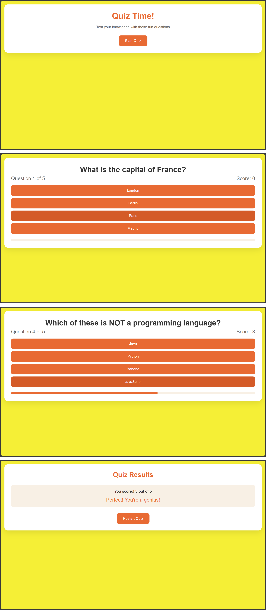

# 🎯 Interactive Quiz Game
A simple interactive quiz game built with **HTML, CSS, and JavaScript** as part of my web development learning journey.

# 🎮 About the Project
This project is a small browser-based quiz game where users can answer multiple-choice questions, get instant feedback, track their score, and see their final result.

It was built as a hands-on learning project while practicing fundamental JavaScript and web development concepts.

# 🌐 Live Demo
[**Play the Quiz Game**](https://ahmediabdelhamied.github.io/Quiz-game-project/)

# 🖼️ Preview

# 🛠️ Technologies Used
* HTML
* CSS
* JavaScript

# 📚 What I Learned
Through this project, I practiced:

* JavaScript variables and functions
* Arrays and objects
* DOM manipulation
* Event handling
* Conditional logic
* Dynamic HTML elements
* Managing application state
* Using `dataset`
* Using `setTimeout()`

# 🚀 Future Improvements
As I continue learning JavaScript, I may come back to this project and experiment with:

* More questions
* Different quiz categories
* A timer
* Difficulty levels
* High scores
* Improved UI and animations

# 📖 Learning Source
This project was created as part of my learning with a beginner JavaScript and web development course.

# 👨‍💻 Author
**Ahmed AbdElhamied**

This repository documents one step in my journey of learning web development and building projects through practice.
